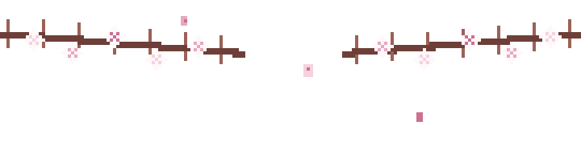

  

 

  

  <strong>소프트웨어공학부</strong> 정보보호학전공
   
  <strong>멋쟁이사자처럼</strong> 대학
   
  <strong>KAKAO X GOORM</strong> DEEPDIVE

 

  

 

  

  <strong>Backend</strong>
   
  
  
  
  
  
    
  <strong>Data</strong>
   
  
  
    
  <strong>Infra / DevOps</strong>
   
  
  
  
    
  <strong>AI Tools</strong>
   
  
  

 

  

 

  quietly building secure and steady services

